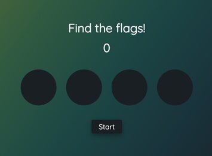

# Speedgame

Speedgame project made for JavaScript course in Business College Helsinki's REACT23K group.

Main practise goals for building this game are

- ESLint code standard
- HTML DOM
- setTimeout
- sounds

## Technologies used

Built with:

- HTML
- JS
- CSS

## Setup and usage

Live page https://public.bc.fi/s2300103/speedgame/

Has mobile support (tested on Samsung Galaxy S8)

Game starts when the user clicks the Start button. User has to click the active/highlighted circles to get points. The score is updated as the game goes on. The pace of the game will go faster and faster as it progresses.

End conditions are

- clicking wrong circle
- 3 missed rounds
- clicking the End button

## Screenshot

## Sources

### README

- README template from [markdown_study_materials](https://github.com/margittennosaar/markdown_study_materials/blob/master/README-template.md)

## Authors and acknowledgment

Julianna Molnár

- GitHub @julilan

Kudos to Margit [@margittennosaar](https://github.com/margittennosaar) for guidance 👏
